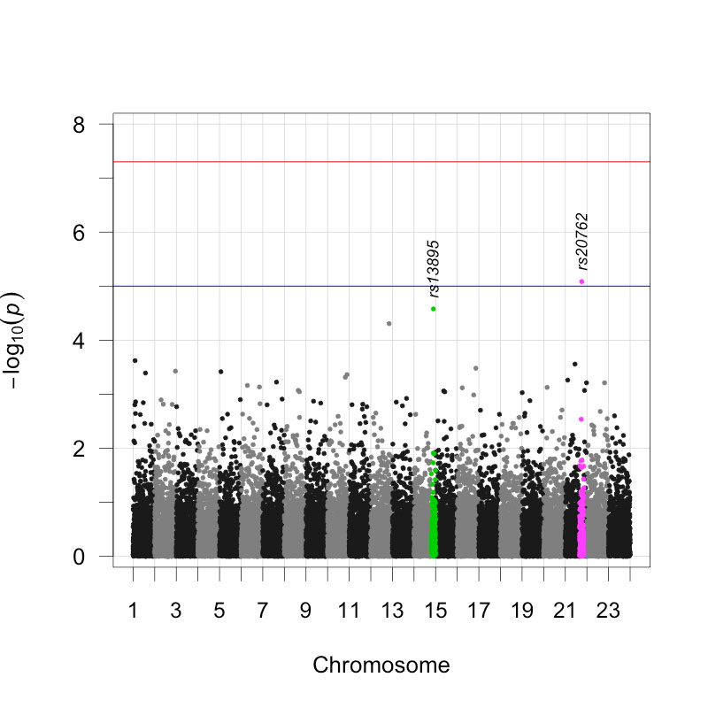
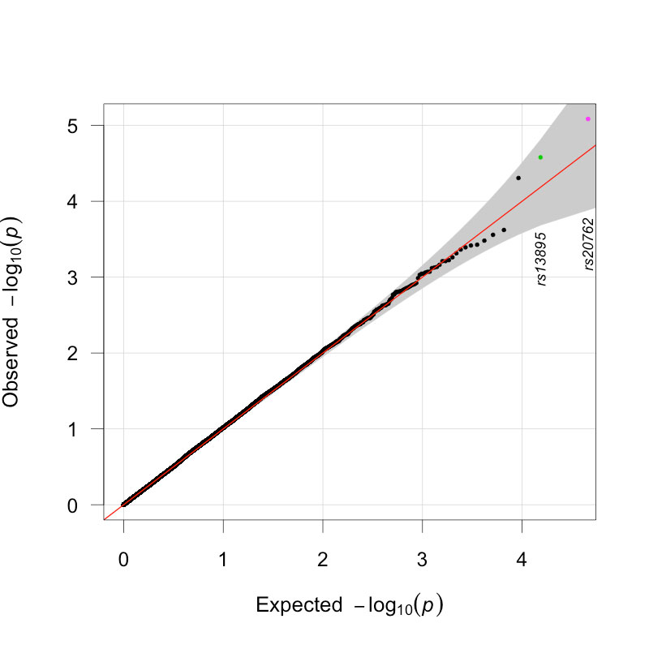

# qqman.r

Please see [Annotated Manhattan plots and QQ plots for GWAS using R](http://gettinggeneticsdone.blogspot.com/2011/04/annotated-manhattan-plots-and-qq-plots.html) for usage instructions.

