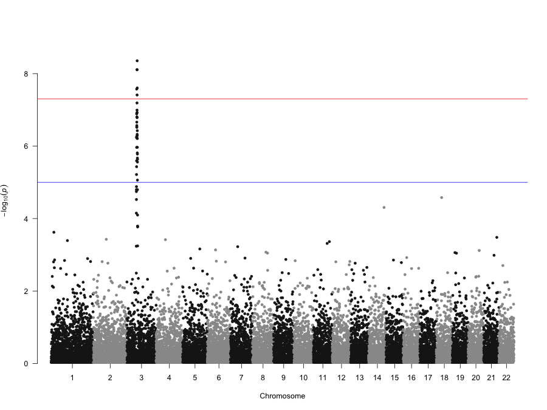
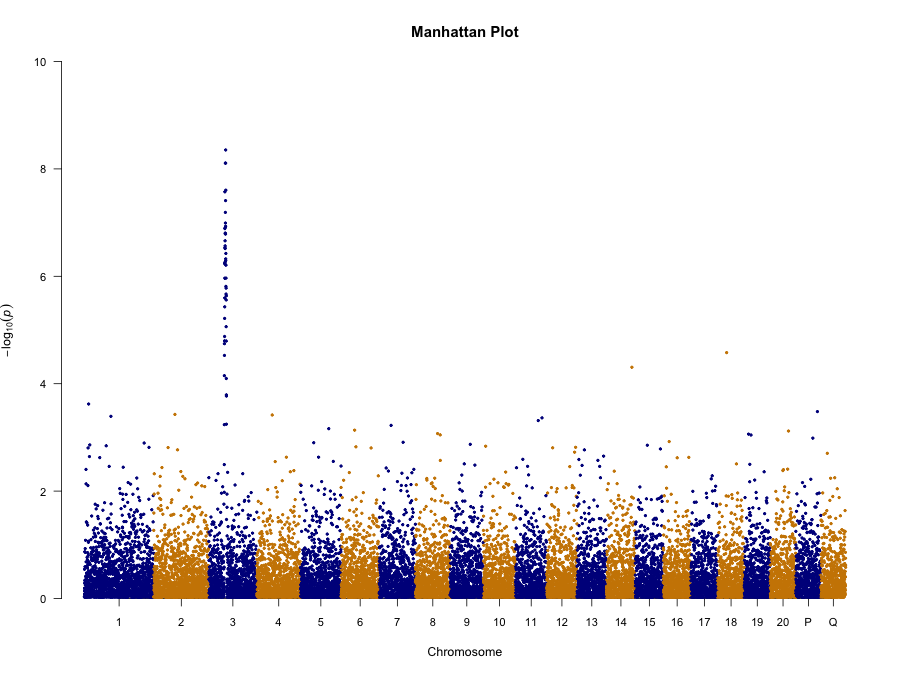
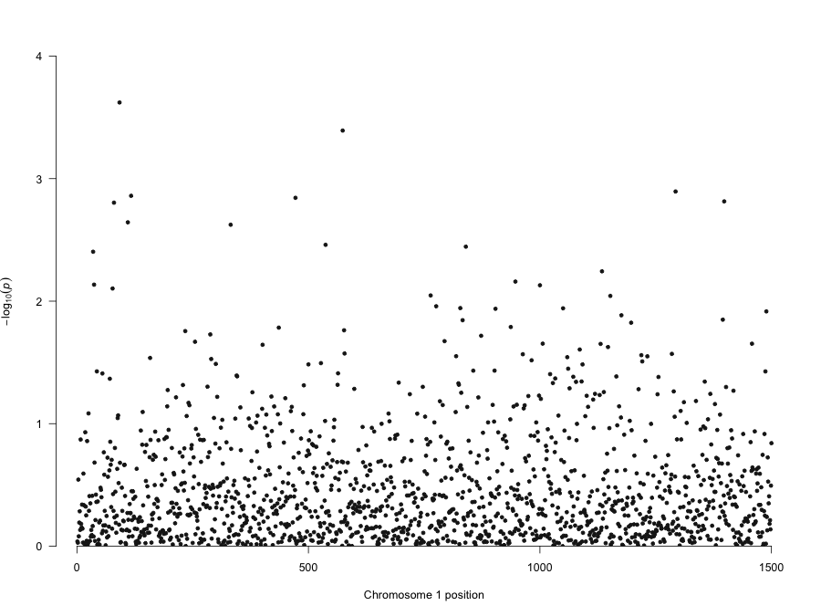
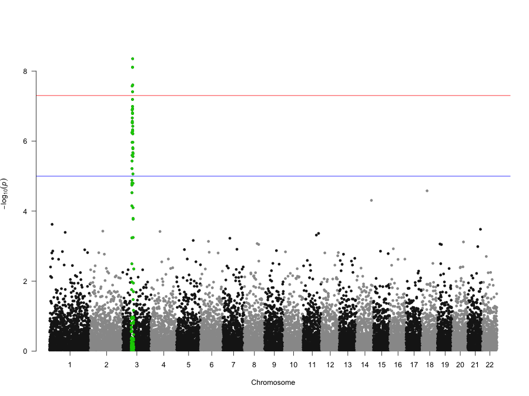
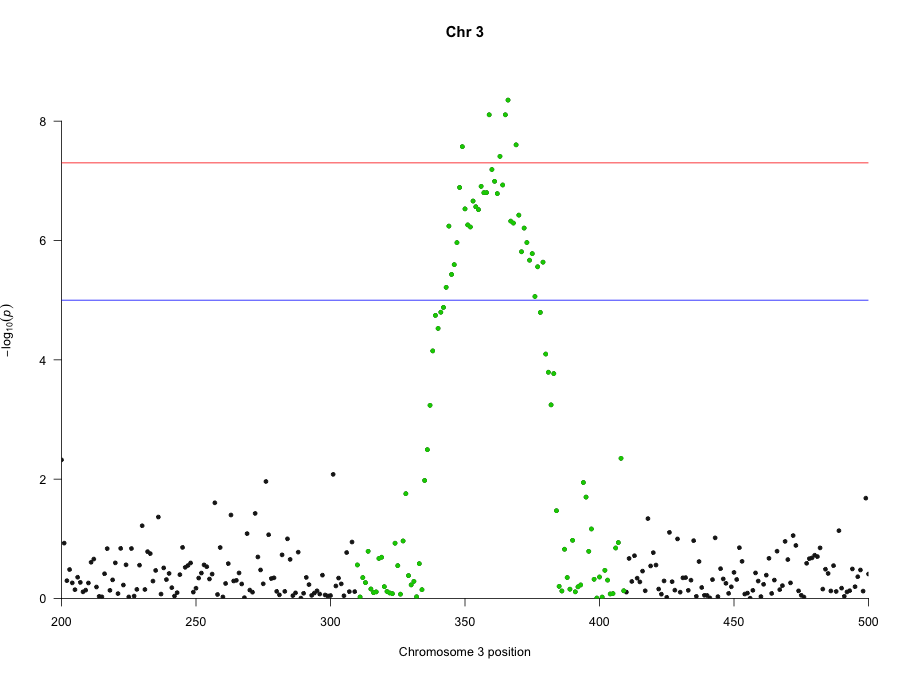
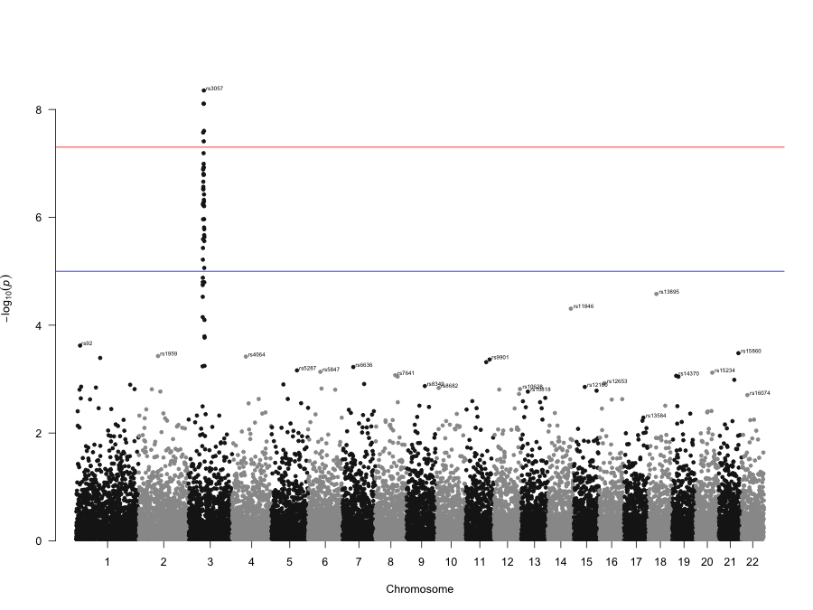
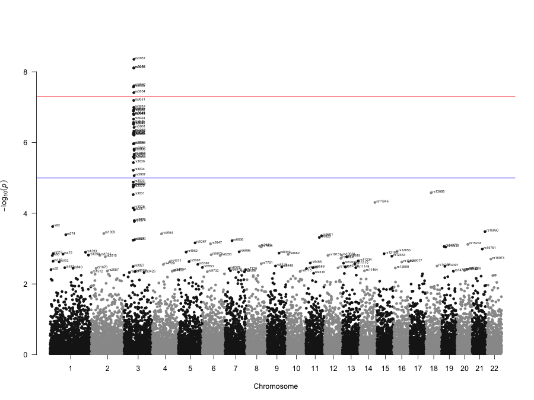
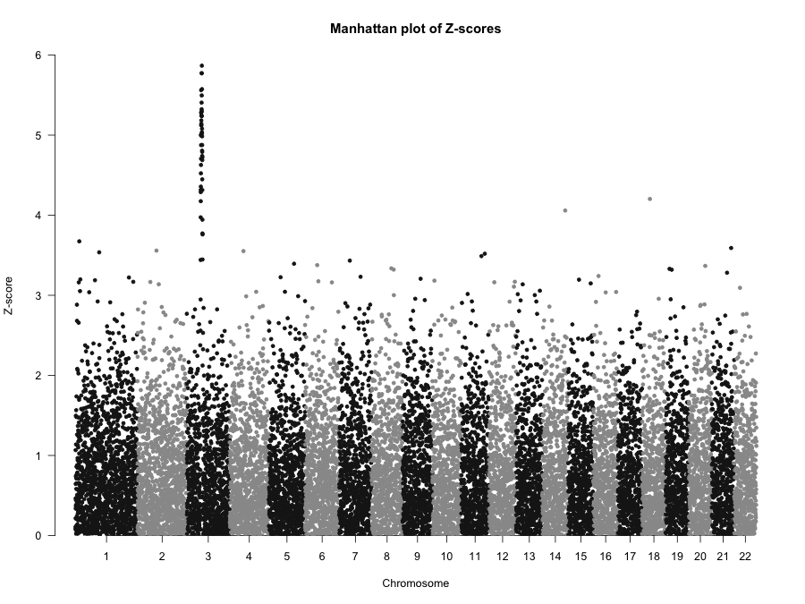
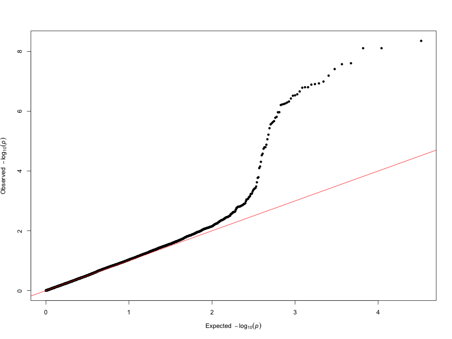
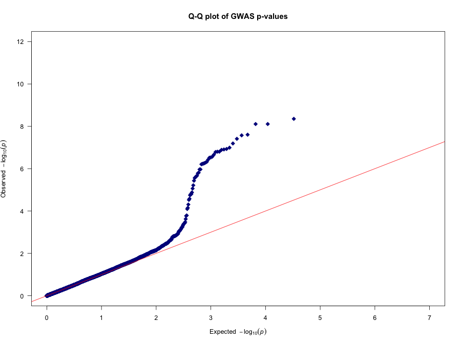

<!--
%\VignetteEngine{knitr::knitr}
%\VignetteIndexEntry{Intro to the qqman package}
-->


# Intro to the **qqman** package


The **qqman** package includes functions for creating manhattan plots and q-q plots from GWAS results. The `gwasResults` data.frame included with the package has simulated results for 16,470 SNPs on 22 chromosomes. Take a look at the data:


```r
str(gwasResults)
```

```
'data.frame':	16470 obs. of  4 variables:
 $ SNP: chr  "rs1" "rs2" "rs3" "rs4" ...
 $ CHR: int  1 1 1 1 1 1 1 1 1 1 ...
 $ BP : int  1 2 3 4 5 6 7 8 9 10 ...
 $ P  : num  0.915 0.937 0.286 0.83 0.642 ...
```

```r
head(gwasResults)
```

```
  SNP CHR BP         P
1 rs1   1  1 0.9148060
2 rs2   1  2 0.9370754
3 rs3   1  3 0.2861395
4 rs4   1  4 0.8304476
5 rs5   1  5 0.6417455
6 rs6   1  6 0.5190959
```

```r
tail(gwasResults)
```

```
          SNP CHR  BP         P
16465 rs16465  22 530 0.5643702
16466 rs16466  22 531 0.1382863
16467 rs16467  22 532 0.3936999
16468 rs16468  22 533 0.1778749
16469 rs16469  22 534 0.2393020
16470 rs16470  22 535 0.2630441
```

How many SNPs on each chromosome?


```r
as.data.frame(table(gwasResults$CHR))
```

```
   Var1 Freq
1     1 1500
2     2 1191
3     3 1040
4     4  945
5     5  877
6     6  825
7     7  784
8     8  750
9     9  721
10   10  696
11   11  674
12   12  655
13   13  638
14   14  622
15   15  608
16   16  595
17   17  583
18   18  572
19   19  562
20   20  553
21   21  544
22   22  535
```

## Creating manhattan plots

Now, let's make a basic manhattan plot. 


```r
manhattan(gwasResults)
```



We can also pass in other graphical parameters. Let's add a title (`main=`), increase the y-axis limit (`ylim=`), reduce the point size to 60% (`cex=`), and reduce the font size of the axis labels to 90% (`cex.axis=`). While we're at it, let's change the colors (`col=`), remove the suggestive and genome-wide significance lines, and supply our own labels for the chromosomes:


```r
manhattan(gwasResults, main = "Manhattan Plot", ylim = c(0, 10), cex = 0.6, cex.axis = 0.9,
    col = c("blue4", "orange3"), suggestiveline = F, genomewideline = F, chrlabs = c(1:20,
        "P", "Q"))
```



Now, let's look at a single chromosome:


```r
manhattan(subset(gwasResults, CHR == 1))
```



Let's highlight some SNPs of interest on chromosome 3. The 100 SNPs we're highlighting here are in a character vector called `snpsOfInterest`. You'll get a warning if you try to highlight SNPs that don't exist.


```r
str(snpsOfInterest)
```

```
 chr [1:100] "rs3001" "rs3002" "rs3003" "rs3004" "rs3005" "rs3006" "rs3007" ...
```

```r
manhattan(gwasResults, highlight = snpsOfInterest)
```



We can combine highlighting and limiting to a single chromosome, and use the `xlim` graphical parameter to zoom in on a region of interest (between position 200-500):


```r
manhattan(subset(gwasResults, CHR == 3), highlight = snpsOfInterest, xlim = c(200,
    500), main = "Chr 3")
```



We can also annotate SNPs based on their p-value. By default, this only annotates the top SNP per chromosome that exceeds the `annotatePval` threshold.


```r
manhattan(gwasResults, annotatePval = 0.01)
```



We can also annotate all SNPs that meet a threshold:


```r
manhattan(gwasResults, annotatePval = 0.005, annotateTop = FALSE)
```



Finally, the `manhattan` function can be used to plot any value, not just p-values. Here, we'll simply call the function passing to the `p=` argument the name of the column we want to plot instead of the default "P" column. In this example, let's create a test statistic ("zscore"), plot that instead of p-values, change the y-axis label, and remove the default log transformation. We'll also remove the genomewide and suggestive lines because these are only meaningful if you're plotting -log10(p-values).


```r
# Add test statistics
gwasResults <- transform(gwasResults, zscore = qnorm(P/2, lower.tail = FALSE))
head(gwasResults)
```

```
  SNP CHR BP         P    zscore
1 rs1   1  1 0.9148060 0.1069785
2 rs2   1  2 0.9370754 0.0789462
3 rs3   1  3 0.2861395 1.0666287
4 rs4   1  4 0.8304476 0.2141275
5 rs5   1  5 0.6417455 0.4652597
6 rs6   1  6 0.5190959 0.6447396
```

```r
# Make the new plot
manhattan(gwasResults, p = "zscore", logp = FALSE, ylab = "Z-score", genomewideline = FALSE,
    suggestiveline = FALSE, main = "Manhattan plot of Z-scores")
```



A few notes on creating manhattan plots:

* Run `str(gwasResults)`. Notice that the `gwasResults` data.frame has SNP, chromosome, position, and p-value columns named `SNP`, `CHR`, `BP`, and `P`. If you're creating a manhattan plot and your column names are different, you'll have to pass the column names to the `chr=`, `bp=`, `p=`, and `snp=` arguments. See `help(manhattan)` for details.
* The chromosome column must be numeric. If you have "X," "Y," or "MT" chromosomes, you'll need to rename these 23, 24, 25, etc. You can modify the source code (e.g., `fix(manhattan)`) to change the line designating the axis tick labels (`labs <- unique(d$CHR)`) to set this to whatever you'd like it to be.
* If you'd like to change the color of the highlight or the suggestive/genomewide lines, you'll need to modify the source code. Search for `col="blue"`, `col="red"`, or `col="green3"` to modify the suggestive line, genomewide line, and highlight colors, respectively.

## Creating Q-Q plots

Creating Q-Q plots is straightforward - simply supply a vector of p-values to the `qq()` function. 


```r
qq(gwasResults$P)
```



We can optionally supply many other graphical parameters.


```r
qq(gwasResults$P, main = "Q-Q plot of GWAS p-values", xlim = c(0, 7), ylim = c(0,
    12), pch = 18, col = "blue4", cex = 1.5, las = 1)
```


